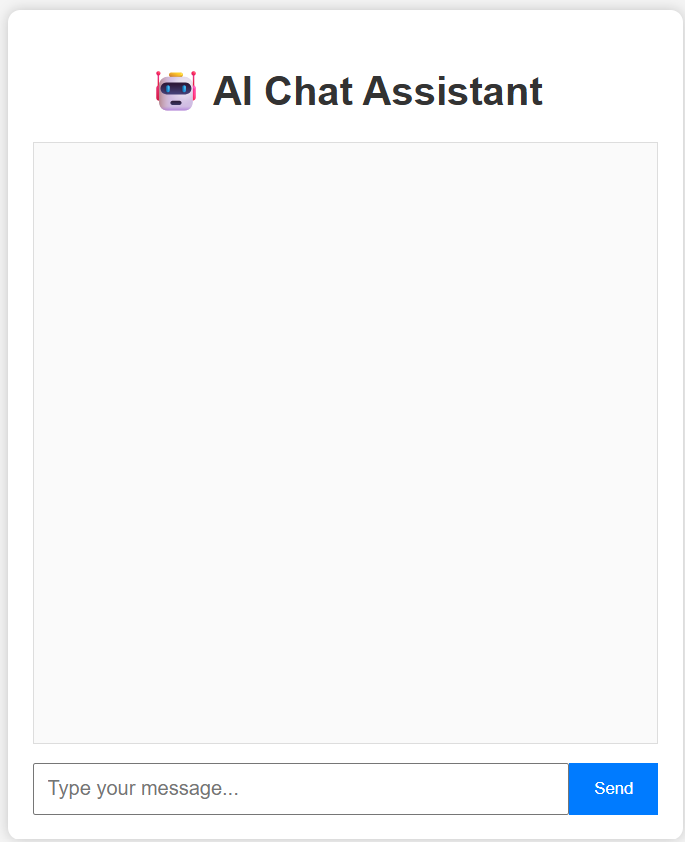

# 🤖 AI Chat Assistant

## Project Overview

AI Chat Assistant is a web-based chatbot developed using **Python**, **Flask**, and the **Google Gemini API**. The chatbot accepts user queries, generates intelligent AI responses, and continues the conversation until the user exits.

---

## Features

- 💬 Accepts user input
- 🤖 Generates AI responses using Gemini API
- 🔄 Supports continuous conversation
- 📝 Displays formatted responses (Markdown)
- 🌐 Simple and responsive web interface
- ⚡ Built using Flask

---

## Technologies Used

- Python
- Flask
- HTML5
- CSS3
- JavaScript
- Google Gemini API
- python-dotenv

---

## Project Structure

```
AI_Chat_Assistant/
│
├── app.py
├── README.md
├── requirements.txt
├── .gitignore
├── static/
│   └── style.css
├── templates/
│   └── index.html
└── screenshots/
```

---

## Installation

### 1. Clone the Repository

```bash
git clone https://github.com/YOUR_USERNAME/AI_Chat_Assistant.git
```

### 2. Open the Project

```bash
cd AI_Chat_Assistant
```

### 3. Create Virtual Environment

```bash
python -m venv venv
```

### 4. Activate Virtual Environment

Windows

```bash
venv\Scripts\activate
```

### 5. Install Dependencies

```bash
pip install -r requirements.txt
```

### 6. Create .env File

```
GEMINI_API_KEY=YOUR_API_KEY
```

### 7. Run the Project

```bash
python app.py
```

Open your browser and visit:

```
http://127.0.0.1:5000
```

---

## Required Dependencies

- Flask
- google-genai
- python-dotenv
- requests
- httpx
- pydantic

---

## Screenshots

### Home Page



### Chat Response


---

## Future Enhancements

- 🎤 Voice Input
- 🔊 Voice Output
- 🖼️ AI Image Generation
- 🌙 Dark Mode
- 💾 Chat History

---

## Author

**Bhumika**

BCA Student

AI Chat Assistant Project